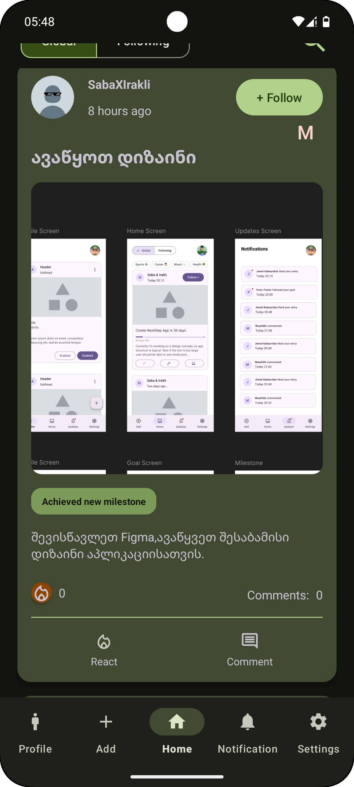
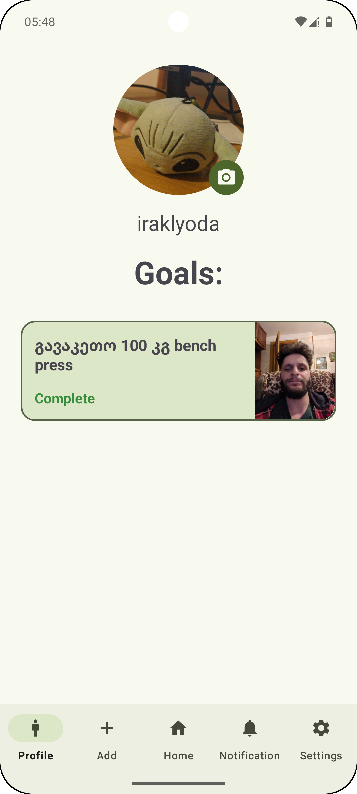
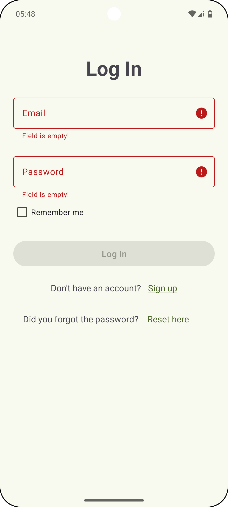

# Next Step 🎯 - Native Android Goal Oriented Social Media App

**Next Step** is a native Android application designed as a social platform focused on sharing progress and achieving personal goals. Built with modern Android development practices, it emphasizes clean architecture, robustness, and a smooth user experience.

## ✨ Features

*   **✍️ Post Creation & Sharing:** Users can create and share posts about their progress, thoughts, or achievements.
*   **🎯 Goal Setting:** Define personal or public goals to track and share progress.
*   **❤️ Reactions:** Engage with posts using meaningful reactions.
*   **🔔 Real-time Notifications:** Stay instantly updated with live notifications powered by Firebase Cloud Functions & FCM.
*   **⏳ Background Uploads:** Posts are uploaded reliably in the background using `WorkManager`, ensuring completion even if the app closes.
*   **🌓 Dual Themes:** Seamlessly switch between **Light** and **Dark** themes for optimal viewing comfort.
*   **🇬🇪/🇺🇸 Multi-language Support:** Fully localized for both **English** and **Georgian** speakers.
*   **⚙️ Compose-Powered Settings:** Modern settings screen built entirely with Jetpack Compose.

## 📸 Screenshots

|  |  |  |
|-------------------------------------|-------------------------------------|-------------------------------------|

## 🛠️ Tech Stack & Architecture

This project follows the principles of **Clean Architecture** and **SOLID** to create a maintainable, scalable, and testable codebase.

*   **Language:** [Kotlin](https://kotlinlang.org/) (100%)
*   **Architecture:** Clean Architecture (Domain, Data, Presentation layers), MVVM (in Presentation)
*   **Asynchronous Programming:**
    *   [Kotlin Coroutines](https://kotlinlang.org/docs/reference/coroutines/overview.html) for managing background threads.
    *   [Kotlin Flow](https://kotlinlang.org/docs/flow.html) for reactive data streams.
    *   [Kotlin Channel](https://kotlinlang.org/docs/channels.html) for communication between coroutines (if applicable, specify use case).
*   **UI:**
    *   **XML Layouts:** Primarily used for most screens, leveraging the traditional Android View system.
    *   [Jetpack Compose](https://developer.android.com/jetpack/compose): Used for the Settings screen, showcasing modern UI development.
    *   Material Design Components
*   **Backend:**
    *   [Firebase](https://firebase.google.com/): Provides backend services including:
        *   Authentication
        *   Firestore
        *   Cloud Storage 
    *   [Firebase Cloud Functions](https://firebase.google.com/docs/functions): For backend logic like triggering notifications.
*   **Background Processing:** [WorkManager](https://developer.android.com/topic/libraries/architecture/workmanager) for guaranteed background task execution (post uploads).
*   **Dependency Injection:** Dagger Hilt
*   **Testing:**
    *   JUnit5
    *   MockK
    *   **100% Unit Test Coverage** for `SettingsViewModel`.

## 🚀 Key Highlights

*   **Clean Architecture & SOLID:** Enforced for better separation of concerns and testability.
*   **Hybrid UI Approach:** Demonstrates proficiency in both traditional XML Views and modern Jetpack Compose.
*   **Robust Background Processing:** Utilizes WorkManager for reliable task execution.
*   **Real-time Features:** Leverages Firebase for live notifications and data synchronization.
*   **Well-Tested:** Includes significant unit test coverage, with key components like `SettingsViewModel` fully tested.
*   **Localization & Theming:** Built with accessibility and user preference in mind.
